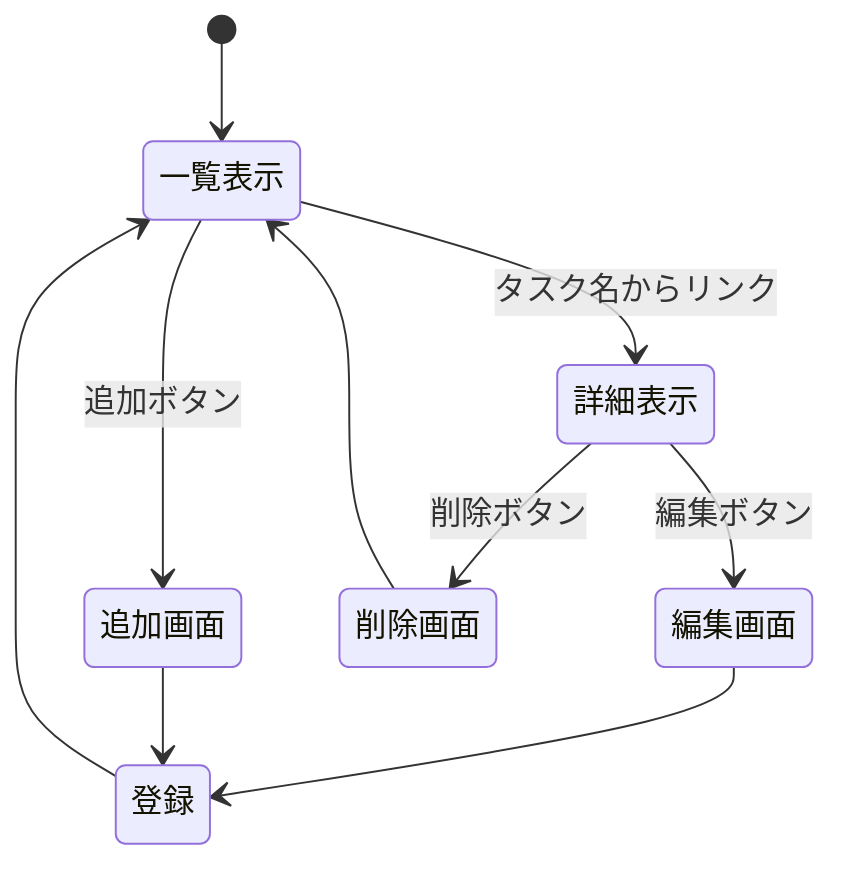

# 開発者用仕様書（仮）

## ToDoリスト機能

### データ構造

項目名 | 型 | 内容
-|-|-
id | 数値 | 識別用のID
title | 文字列 | タスク名
deadline | 文字列 | タスクの期限
status | 文字列 | 進行状況

### ページ遷移

### HTTPメソッドとリソース名の一覧

HTTPメソッド | リソース名 | 機能概要 | 機能の詳細
-|-|-|-
GET | /todos | 一覧表示 | ToDoリストを表示する
GET | /todos/:id | 詳細表示 | 特定のタスクの詳細を表示する
GET | /todos/create | 新規登録フォーム | 新規登録用のフォームを表示する
POST | /todos | 新規登録処理 | 入力内容を保存する
GET | /todos/edit/:id | 編集フォーム | 既存データの編集用フォームを表示する
POST | /todos/update/:id | 更新処理 | 編集内容を上書き保存する
GET | /todos/delete/:id | 削除処理 | 特定のタスクを削除する

